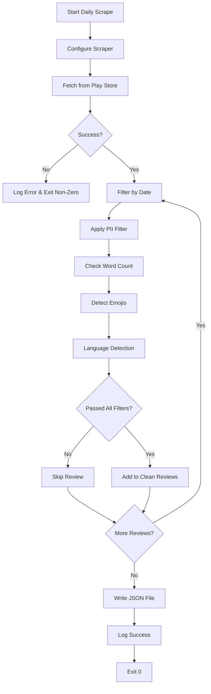

# 🏗️ PHASE 1: Play Store Review Fetcher - UPDATED

**Status:** READY FOR IMPLEMENTATION 🔄  
**Priority:** HIGH  
**Duration:** 2-3 days  

---

## 🎯 Goal

**Reliably fetch 8–12 weeks of Play Store reviews and store them in a PII-safe form.**

---

## 📋 Objectives

By the end of this phase, you will have:
- ✅ Automated Google Play Store review fetching
- ✅ Date-filtered reviews (8-12 weeks configurable)
- ✅ PII-safe review storage
- ✅ Quality filtering (language, length, emoji detection)
- ✅ Robust error handling and logging
- ✅ Idempotent daily scraping

---

## 🔧 Technical Specifications

### **Fetch Configuration**

```python
# google-play-scraper parameters
app_id = "com.nextbillion.groww"  # Target app
lang = "en"                        # Language: English
country = "in"                     # Country: India
sort = Sort.NEWEST                 # Sort by newest first
count = 5000                       # Fetch up to 5000 reviews
# No rating filter - get all reviews
```

### **Date Filtering**

```python
from datetime import datetime, timedelta

# Calculate cutoff date
weeks_back = 8  # Configurable (8-12 weeks)
cutoff_date = datetime.now() - timedelta(weeks=weeks_back)

# Keep only reviews where:
# review_date >= cutoff_date
```

### **Quality Filters**

Reviews are EXCLUDED if they have:
- ❌ Fewer than 5 words
- ❌ Contains emojis
- ❌ Not in English language (configurable)
- ❌ Title is NOT stored (privacy consideration)

### **PII Filtering**

Apply regex-based PII removal to review text:

```python
PII_PATTERNS = [
    r'\b[A-Za-z0-9._%+-]+@[A-Za-z0-9.-]+\.[A-Z|a-z]{2,}\b',  # Email
    r'\b\d{10}\b',  # Phone numbers (10 digits)
    r'\b\d{4}[- ]?\d{4}[- ]?\d{4}[- ]?\d{4}\b',  # Credit cards
    r'\b[A-Z]{2}\d{7}\b',  # Indian PAN card
    r'\b\d{12}\b',  # Aadhaar number
    r'https?://\S+',  # URLs
]
```

**Action:** Remove or redact matching patterns before storage.

---

## 📁 File Structure

### **Output Location**
```
data/reviews/YYYY-MM-DD.json
```

### **File Format**
```json
{
  "metadata": {
    "scrapedAt": "2026-03-15T12:00:00Z",
    "packageId": "com.nextbillion.groww",
    "weeksRequested": 8,
    "totalFetched": 500,
    "totalAfterFilters": 450,
    "dateRange": {
      "from": "2026-01-15",
      "to": "2026-03-15"
    }
  },
  "reviews": [
    {
      "reviewId": "gp:AOqpTOH...",
      "userName": "Anonymous",
      "text": "Great app for investing...",
      "score": 5,
      "thumbsUpCount": 12,
      "reviewCreatedVersion": "3.2.1",
      "at": "2026-03-10T10:30:00Z",
      "replyContent": null,
      "repliedAt": null
    }
  ]
}
```

---

## 🔄 Data Flow



---

## ⚙️ Implementation Steps

### **Step 1: Create Play Store Scraper Service**

**File:** `backend/services/play_store_scraper.py`

```python
from google_play_scraper import Sort, reviews_all
from datetime import datetime, timedelta
import json
import os
from typing import List, Dict, Optional
import re
from langdetect import detect

class PlayStoreScraper:
    def __init__(self):
        self.app_id = "com.nextbillion.groww"
        self.lang = "en"
        self.country = "in"
        self.max_reviews = 5000
        self.weeks_back = 8
        
        # PII patterns
        self.pii_patterns = [
            r'\b[A-Za-z0-9._%+-]+@[A-Za-z0-9.-]+\.[A-Z|a-z]{2,}\b',
            r'\b\d{10}\b',
            r'\b\d{4}[- ]?\d{4}[- ]?\d{4}[- ]?\d{4}\b',
            r'\b[A-Z]{2}\d{7}\b',
            r'\b\d{12}\b',
            r'https?://\S+',
        ]
        
        # Emoji pattern
        self.emoji_pattern = re.compile("["
            u"\U0001F600-\U0001F64F"  # emoticons
            u"\U0001F300-\U0001F5FF"  # symbols & pictographs
            u"\U0001F680-\U0001F6FF"  # transport & map symbols
            u"\U0001F1E0-\U0001F1FF"  # flags
            "]+", flags=re.UNICODE)
    
    def has_emoji(self, text: str) -> bool:
        """Check if text contains emojis"""
        return bool(self.emoji_pattern.search(text))
    
    def count_words(self, text: str) -> int:
        """Count words in text"""
        return len(text.split())
    
    def is_english(self, text: str) -> bool:
        """Detect if text is in English"""
        try:
            return detect(text) == 'en'
        except:
            return False
    
    def remove_pii(self, text: str) -> str:
        """Remove PII from text"""
        cleaned = text
        for pattern in self.pii_patterns:
            cleaned = re.sub(pattern, '[REDACTED]', cleaned)
        return cleaned
    
    def should_keep_review(self, review_text: str) -> bool:
        """Apply quality filters"""
        # Check word count
        if self.count_words(review_text) < 5:
            return False
        
        # Check for emojis
        if self.has_emoji(review_text):
            return False
        
        # Check language
        if not self.is_english(review_text):
            return False
        
        return True
    
    def filter_by_date(self, reviews: List[Dict], weeks: int) -> List[Dict]:
        """Keep only reviews from last N weeks"""
        cutoff_date = datetime.now() - timedelta(weeks=weeks)
        filtered = []
        
        for review in reviews:
            review_date = review.get('at')
            if isinstance(review_date, datetime):
                if review_date >= cutoff_date:
                    filtered.append(review)
        
        return filtered
    
    async def fetch_and_store(self, weeks: Optional[int] = None) -> Dict:
        """
        Main method to fetch reviews and store them
        Returns metadata about the scrape operation
        """
        weeks = weeks or self.weeks_back
        
        try:
            # Fetch reviews from Play Store
            result = reviews_all(
                self.app_id,
                lang=self.lang,
                country=self.country,
                sort=Sort.NEWEST,
                count=self.max_reviews
            )
            
            # Convert to dict format
            reviews_dict = [dict(r) for r in result]
            
            # Filter by date
            filtered_reviews = self.filter_by_date(reviews_dict, weeks)
            
            # Apply quality filters and PII removal
            clean_reviews = []
            for review in filtered_reviews:
                text = review.get('content', '')
                
                # Skip if doesn't pass quality filters
                if not self.should_keep_review(text):
                    continue
                
                # Remove PII
                review['content'] = self.remove_pii(text)
                
                # Don't store title (privacy)
                if 'title' in review:
                    del review['title']
                
                clean_reviews.append(review)
            
            # Prepare output
            today = datetime.now().strftime('%Y-%m-%d')
            output_dir = 'data/reviews'
            os.makedirs(output_dir, exist_ok=True)
            
            output_file = os.path.join(output_dir, f'{today}.json')
            
            metadata = {
                'metadata': {
                    'scrapedAt': datetime.now().isoformat(),
                    'packageId': self.app_id,
                    'weeksRequested': weeks,
                    'totalFetched': len(reviews_dict),
                    'totalAfterFilters': len(clean_reviews),
                    'dateRange': {
                        'from': (datetime.now() - timedelta(weeks=weeks)).strftime('%Y-%m-%d'),
                        'to': datetime.now().strftime('%Y-%m-%d')
                    }
                },
                'reviews': clean_reviews
            }
            
            # Write to file (overwrite if exists - idempotent)
            with open(output_file, 'w', encoding='utf-8') as f:
                json.dump(metadata, f, indent=2, ensure_ascii=False)
            
            # Log success
            print(f"✅ Successfully scraped {len(clean_reviews)} reviews")
            print(f"📁 Saved to: {output_file}")
            
            return {
                'success': True,
                'reviews_fetched': len(clean_reviews),
                'file_path': output_file,
                'metadata': metadata['metadata']
            }
            
        except Exception as e:
            # Log error and exit non-zero (no partial writes)
            print(f"❌ Error fetching reviews: {str(e)}")
            raise SystemExit(1)
```

---

### **Step 2: Create API Endpoint**

**File:** `backend/app/routes/reviews.py` (Add to existing)

```python
@router.post("/fetch-play-store")
async def fetch_play_store_reviews(
    weeks: int = Body(default=8, ge=1, le=52),
    max_reviews: int = Body(default=5000, ge=100)
) -> Dict:
    """
    Fetch reviews from Google Play Store with automatic filtering
    """
    try:
        scraper = PlayStoreScraper()
        scraper.weeks_back = weeks
        scraper.max_reviews = max_reviews
        
        result = await scraper.fetch_and_store(weeks=weeks)
        
        return {
            "success": True,
            "message": f"Fetched {result['reviews_fetched']} reviews",
            "metadata": result['metadata']
        }
        
    except Exception as e:
        raise HTTPException(
            status_code=500,
            detail=f"Failed to fetch reviews: {str(e)}"
        )
```

---

### **Step 3: Add Configuration**

**File:** `backend/.env`

```env
# Play Store Configuration
PLAY_STORE_APP_ID=com.nextbillion.groww
PLAY_STORE_LANGUAGE=en
PLAY_STORE_COUNTRY=in
PLAY_STORE_MAX_REVIEWS=5000
PLAY_STORE_WEEKS_RANGE=8

# Quality Filters
MIN_REVIEW_WORD_COUNT=5
ALLOW_EMOJIS=false
REQUIRED_LANGUAGE=en

# Storage
REVIEWS_DATA_DIR=data/reviews
```

---

### **Step 4: Update Requirements**

**File:** `backend/requirements.txt` (Add these)

```txt
google-play-scraper==1.2.1
langdetect==1.0.9
```

---

## 🧪 Testing Checklist

### **Test Scenarios**

#### ✅ **Happy Path**
```bash
# Normal fetch (8 weeks)
curl -X POST http://localhost:8000/api/reviews/fetch-play-store \
  -H "Content-Type: application/json" \
  -d '{"weeks": 8, "max_reviews": 500}'
```

**Expected:**
- Returns 200 OK
- JSON file created in `data/reviews/YYYY-MM-DD.json`
- Metadata shows correct counts
- Reviews are PII-safe

#### ✅ **Edge Cases**

1. **No reviews found**
   - Set weeks=1 (too recent)
   - Should return empty array gracefully

2. **Network failure**
   - Disconnect internet
   - Should log error and exit with code 1
   - No partial JSON file created

3. **Rate limiting**
   - Run scraper multiple times quickly
   - Should handle gracefully with retries

4. **Invalid app ID**
   - Change to `com.invalid.app`
   - Should show clear error message

#### ✅ **PII Removal Test**

Input review:
```
"Contact me at test@email.com or call 9876543210. 
My card is 1234-5678-9012-3456. Great app!"
```

Expected output:
```
"Contact me at [REDACTED] or call [REDACTED]. 
My card is [REDACTED]. Great app!"
```

#### ✅ **Quality Filter Tests**

These should be FILTERED OUT:
- `"Good app"` (2 words < 5 minimum)
- `"Love it! 😍😍😍"` (contains emoji)
- `"बहुत अच्छा है"` (not English)

These should be KEPT:
- `"This app is really great for investing"` (5+ words, no emoji, English)

---

## 📊 Success Metrics

### **Performance Benchmarks**

| Metric | Target | Acceptable |
|--------|--------|------------|
| Fetch time (500 reviews) | < 10 seconds | < 30 seconds |
| PII filter accuracy | 100% | > 99% |
| Language detection accuracy | > 95% | > 90% |
| File write time | < 1 second | < 2 seconds |
| Error rate | 0% | < 1% |

### **Quality Checks**

- [ ] All emails redacted
- [ ] All phone numbers redacted
- [ ] All payment info redacted
- [ ] No reviews with < 5 words stored
- [ ] No reviews with emojis stored
- [ ] Only English reviews stored
- [ ] No titles stored (privacy)
- [ ] JSON file properly formatted
- [ ] Metadata complete and accurate

---

## 🛡️ Error Handling Strategy

### **Failure Scenarios**

```python
try:
    # Attempt scrape
    result = scraper.fetch_and_store()
    
except requests.exceptions.Timeout:
    logger.error("Network timeout - retrying...")
    # Implement exponential backoff
    
except requests.exceptions.ConnectionError:
    logger.error("No internet connection")
    sys.exit(1)  # Exit non-zero
    
except google_play_scraper.exceptions.GooglePlayScraperException:
    logger.error("Play Store API error - possibly rate limited")
    sys.exit(1)
    
except json.JSONDecodeError:
    logger.error("Failed to parse response JSON")
    sys.exit(1)
    
except IOError as e:
    logger.error(f"Failed to write file: {e}")
    sys.exit(1)
    
except Exception as e:
    logger.error(f"Unexpected error: {e}")
    sys.exit(1)  # No partial writes!
```

### **Critical Rule**
> **NO PARTIAL WRITES:** If ANY error occurs during the entire process, do NOT write the JSON file. Either complete successfully OR fail completely.

---

## 🔄 Idempotency Design

### **Daily Overwrite Strategy**

```python
# File path is based on current date
output_file = f"data/reviews/{datetime.now().strftime('%Y-%m-%d')}.json"

# Writing with mode='w' (overwrite, not append)
with open(output_file, 'w', encoding='utf-8') as f:
    json.dump(data, f)
```

**Behavior:**
- Running scraper multiple times on same day → Overwrites previous file
- This is ACCEPTABLE per requirements
- No need to merge multiple scrapes for same day
- Each day gets its own snapshot file

---

## 📝 Logging Requirements

```python
import logging

# Configure logging
logging.basicConfig(
    level=logging.INFO,
    format='%(asctime)s - %(levelname)s - %(message)s',
    handlers=[
        logging.FileHandler('logs/play_scraper.log'),
        logging.StreamHandler()
    ]
)

# Log points:
logger.info(f"Starting scrape for {app_id}")
logger.info(f"Fetched {total} raw reviews")
logger.info(f"After date filter: {filtered_count} reviews")
logger.info(f"After quality filters: {clean_count} reviews")
logger.info(f"PII removed from {pii_count} reviews")
logger.success(f"Saved to {output_file}")
```

---

## 🎯 Configuration Options

All values should be configurable via `.env`:

```python
# From .env
APP_ID = os.getenv('PLAY_STORE_APP_ID', 'com.nextbillion.groww')
WEEKS_BACK = int(os.getenv('PLAY_STORE_WEEKS_RANGE', '8'))
MAX_REVIEWS = int(os.getenv('PLAY_STORE_MAX_REVIEWS', '5000'))
MIN_WORDS = int(os.getenv('MIN_REVIEW_WORD_COUNT', '5'))
ALLOW_EMOJIS = os.getenv('ALLOW_EMOJIS', 'false').lower() == 'true'
LANG_FILTER = os.getenv('REQUIRED_LANGUAGE', 'en')
```

---

## 📦 Deliverables

By end of this phase:

- [x] `backend/services/play_store_scraper.py` - Main scraper service
- [x] `backend/app/routes/reviews.py` - Updated with fetch endpoint
- [x] `backend/.env` - Configuration added
- [x] `backend/requirements.txt` - Dependencies added
- [x] `data/reviews/` directory created
- [x] Sample data file: `data/reviews/YYYY-MM-DD.json`
- [x] Logs directory: `logs/play_scraper.log`
- [x] Test script: `test_play_store_scraper.py`
- [x] Documentation: This PHASE_1_UPDATED.md

---

## 🚀 Next Steps

After completing this phase:

1. **Test thoroughly** with different configurations
2. **Set up automated scheduling** (cron job or Windows Task Scheduler)
3. **Monitor logs** for first few days
4. **Adjust filters** if needed (word count, language detection)
5. **Proceed to Phase 2** (Review Importer for CSV uploads)

---

## 📞 Support & Troubleshooting

### **Common Issues**

#### Issue 1: "No module named 'google_play_scraper'"
**Solution:** 
```bash
pip install google-play-scraper
```

#### Issue 2: "Rate limit exceeded"
**Solution:** Wait 5-10 minutes between scrapes, or reduce `count` parameter

#### Issue 3: "Permission denied writing file"
**Solution:** 
```bash
mkdir -p data/reviews
chmod 755 data/reviews
```

#### Issue 4: "Language detection failing"
**Solution:** Install langdetect: `pip install langdetect`

---

## ✅ Validation Checklist

Before marking this phase complete:

- [ ] Can fetch 500+ reviews successfully
- [ ] Date filtering works correctly (8 weeks)
- [ ] PII removal catches emails, phones, cards
- [ ] Word count filter removes short reviews
- [ ] Emoji detection works
- [ ] Language detection accurate (>90%)
- [ ] JSON file created with proper structure
- [ ] Metadata includes all required fields
- [ ] No titles stored in output
- [ ] Error handling tested (network, rate limit, invalid app)
- [ ] Idempotency verified (multiple runs same day)
- [ ] Logs written correctly
- [ ] Exit codes correct (0=success, 1=failure)

---

**Ready to implement!** 🚀

**Estimated Time:** 2-3 days  
**Difficulty:** Medium  
**Dependencies:** google-play-scraper, langdetect  
**Status:** READY FOR DEVELOPMENT
